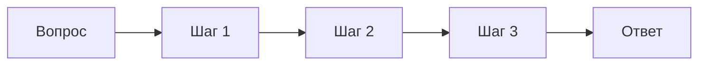

# Chain-of-Thought (CoT)

> Модель пишет промежуточные шаги рассуждения в тексте перед финальным ответом - простейший способ поднять точность на задачах, требующих нескольких логических шагов.

## Суть

**Chain-of-Thought** (Wei et al., NeurIPS 2022) - прием промптинга: вместо того чтобы выдать ответ сразу, модель сначала разворачивает цепочку рассуждения (промежуточные шаги, вычисления, посылки), а затем дает итог. Это перекладывает часть «вычислений» в выходные токены и заметно улучшает арифметику, логику и многошаговые задачи.

Два основных варианта:
- **Few-shot CoT** - в промпт кладут несколько примеров, где ответ сопровождается пошаговым рассуждением; модель перенимает формат.
- **Zero-shot CoT** (Kojima et al., 2022) - достаточно приписать «Давай рассуждать пошагово» без примеров.

CoT почти ничего не стоит (один вызов, чуть больше выходных токенов) и часто идет «фоном» в других паттернах: [ReAct](../react/) добавляет к рассуждению действия, [Self-Consistency](../self-consistency/) берет несколько CoT-траекторий и голосует, деревья (**ToT**) ветвят их.

Ограничение - **одна линейная траектория**: рассуждение не ветвится и не откатывается, поэтому ошибка на раннем шаге необратима и тянет за собой неверный ответ. Кроме того, CoT сам по себе не сверяется с внешним миром (в отличие от ReAct/CRITIC) - он лишь структурирует внутренние рассуждения модели.

## Схема

Схема в отдельном файле: [`diagram.mmd`](diagram.mmd).

## Когда применять / когда не применять

**Применять, если:**
- задача требует нескольких логических/арифметических шагов;
- полезно увидеть ход рассуждения (аудит, отладка промпта);
- нужен дешевый прирост точности без инструментов и циклов.

**Не применять, если:**
- задача решается одним шагом (CoT только раздувает вывод);
- нужна проверка фактов внешним источником - тогда [ReAct](../react/) или **CRITIC**;
- используется reasoning-модель (o-series, DeepSeek-R1, extended thinking): она уже рассуждает «внутри», и лишний CoT-скаффолд может ухудшить результат. См. [`taxonomy.md`](../../../taxonomy.md#ключевой-сдвиг-20252026).

## Компромиссы

- **Стоимость.** Почти бесплатно: один LLM-вызов, только выходных токенов чуть больше.
- **Точность vs линейность.** Прирост качества реален, но одна траектория не защищает от ранней ошибки. Лечится выборкой нескольких путей (**Self-Consistency**) или деревьями (**ToT**) - ценой ×N вызовов.
- **Надежность.** CoT структурирует рассуждение, но не заземляет его: сам по себе не отличает правильный вывод от уверенно-неправильного. Внешняя проверка (инструмент, независимый критик) надежнее.
- **Прозрачность.** Виден ход мысли - плюс для отладки; но «объяснение» не гарантирует, что ответ получен именно так.

## Вариации и развитие

- **[Self-Consistency](../self-consistency/)** - сэмплирует несколько CoT-траекторий и берет самый частый ответ (маргинализация); заметный прирост точности ценой N-кратной стоимости.
- **[ReAct](../react/)** - чередует рассуждение (Thought) с действиями (Action) и наблюдениями; CoT + инструменты.
- **ToT / GoT** - превращают линейную цепочку в дерево/граф мыслей с оценкой узлов и бэктрекингом.
- **Reasoning-модели** - интернализуют CoT в веса через RL; явный CoT-промптинг для них частично теряет смысл.

## Реализации

- **Без фреймворков:** [`example.py`](example.py) - контраст «прямой ответ» vs «zero-shot CoT» на одной задаче, один вызов на каждый вариант.
- **Промптинг:** few-shot (примеры с рассуждением) или zero-shot («Давай рассуждать пошагово»). Никакой инфраструктуры не требуется.

## Источники

- Wei et al. «Chain-of-Thought Prompting Elicits Reasoning in Large Language Models», NeurIPS 2022 - arXiv:2201.11903.
- Kojima et al. «Large Language Models are Zero-Shot Reasoners», 2022 - arXiv:2205.11916 (zero-shot CoT).
- Сводка по группе: [`../README.md`](../README.md).

## Мои заметки

- Проверить на reasoning-модели: действительно ли явный CoT-промпт не помогает или мешает - на своей задаче.
