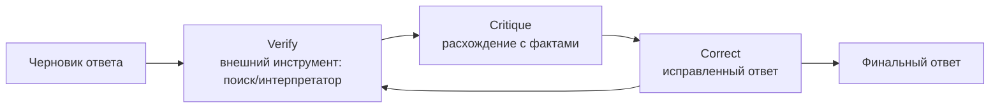

# CRITIC

> Цикл «проверить → раскритиковать → исправить», где проверка опирается на внешние инструменты (поиск, интерпретатор), а не на самооценку модели.

## Суть

**CRITIC** (Gou et al., ICLR 2024) исправляет главную слабость интроспективной самокоррекции: модель плохо видит собственные ошибки. Вместо самооценки CRITIC заземляет проверку на **внешние инструменты**:
1. **Verify** - черновик ответа прогоняется через инструмент: веб-поиск проверяет факты, интерпретатор - вычисления и код;
2. **Critique** - расхождение между ответом и результатом инструмента формулируется как конкретная претензия;
3. **Correct** - модель переписывает ответ с учетом внешнего сигнала.

Цикл повторяется, пока проверка не перестанет находить расхождения. Ключевое отличие от [Self-Refine](../self-refine/) - критика не «из головы», а от внешнего верификатора; это делает коррекцию надежной там, где интроспекция обманчива (факты, арифметика, код).

Важный контекст: работа Huang et al. (ICLR 2024) показала, что «intrinsic self-correction» без внешнего сигнала ненадежна. CRITIC и evaluator-optimizer с **независимым** источником проверки - прямой ответ на это: коррекция должна опираться на что-то вне самой модели.

## Схема

Схема в отдельном файле: [`diagram.mmd`](diagram.mmd).

## Когда применять / когда не применять

**Применять, если:**
- ответ проверяем внешним инструментом (факт - поиском, вычисление/код - интерпретатором);
- цена ошибки высока и оправдывает вызовы инструментов;
- нужна коррекция надежнее, чем интроспективный [Self-Refine](../self-refine/).

**Не применять, если:**
- нет подходящего внешнего верификатора (тогда преимущество над Self-Refine теряется);
- задача чисто «мягкая» (стиль/тон), где инструменту нечего проверять;
- бюджет не позволяет дополнительные проходы с инструментами.

## Компромиссы

- **Надежность.** Внешняя проверка честнее самооценки - главный выигрыш против Self-Refine.
- **Стоимость и инфраструктура.** Нужны инструменты (поиск, песочница-интерпретатор) и цикл вызовов; дороже чистой интроспекции.
- **Границы применимости.** Помогает ровно настолько, насколько верификатор покрывает тип ошибок; вне его зоны CRITIC бессилен.
- **Безопасность.** Интерпретатор кода требует песочницы (см. [группу 07](../../07-infra-safety-eval/)).

## Вариации и развитие

- **[Self-Refine](../self-refine/)** - тот же цикл, но без внешних инструментов (интроспекция).
- **[Reflexion](../reflexion/)** - внешний сигнал успеха/неудачи + память уроков между попытками.
- **evaluator-optimizer** (группа 04) - родственный workflow: генератор + независимый оценщик в цикле.
- **[ReAct](../react/)** - CRITIC можно видеть как ReAct, где инструменты используются именно для верификации ответа.

## Реализации

- **Без фреймворков:** [`example.py`](example.py) - модель отвечает на арифметическую задачу и дает выражение; внешний калькулятор независимо проверяет счет; при расхождении модель исправляет ответ.

## Источники

- Gou et al. «CRITIC: Large Language Models Can Self-Correct with Tool-Interactive Critiquing», ICLR 2024 - arXiv:2305.11738.
- Huang et al. «Large Language Models Cannot Self-Correct Reasoning Yet», ICLR 2024.
- Сводка по группе: [`../README.md`](../README.md).

## Мои заметки

- Определить, какой верификатор покрывает ошибки моей задачи (поиск? интерпретатор? БД?) - вне его зоны CRITIC не поможет.
