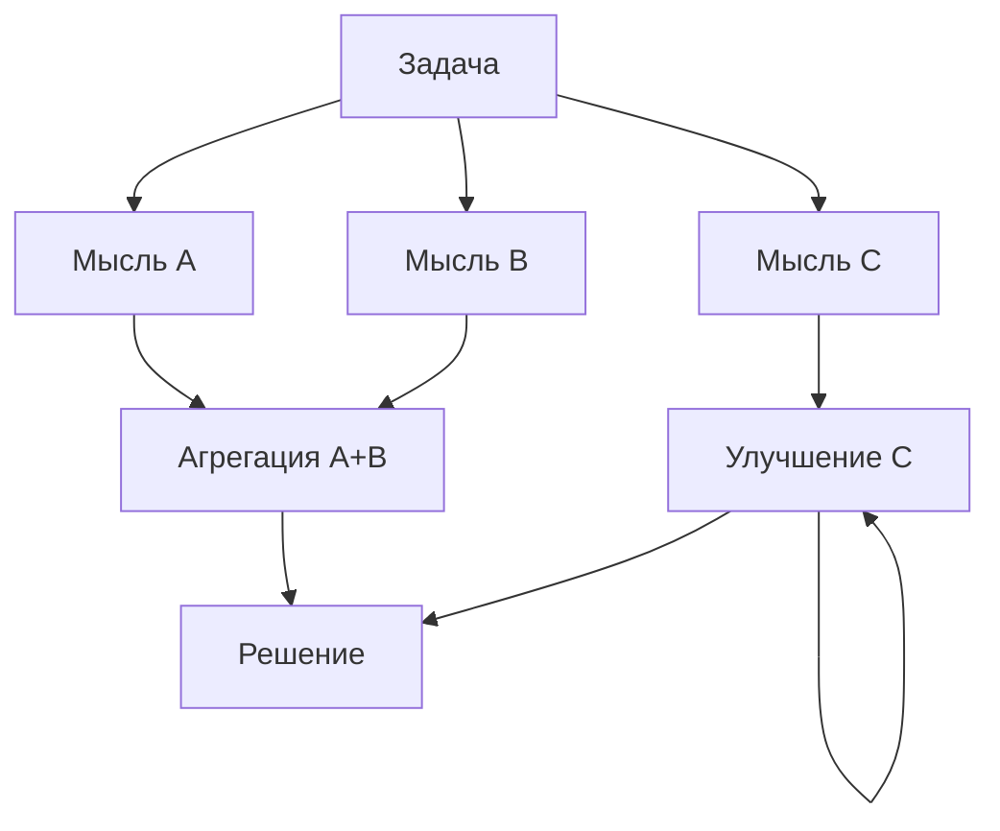

# Graph of Thoughts (GoT)

> Мысли образуют граф, а не дерево: ветви можно агрегировать, переиспользовать и уточнять циклами - гибче ToT, но сложнее в реализации.

## Суть

**Graph of Thoughts** (Besta et al., 2023) обобщает [Tree of Thoughts](../tot/): «мысли» - это узлы **произвольного графа**, а ребра - операции над ними. По сравнению с деревом, где у узла один родитель и ветви не пересекаются, граф позволяет:
- **агрегировать** несколько мыслей в одну (слияние частичных решений);
- **переиспользовать** узел в разных ветвях (общие подзадачи считаются один раз);
- **уточнять** мысль циклом (петля улучшения над тем же узлом).

Работа формализует это как «графы операций»: генерация, агрегация, улучшение, оценка. На задачах вроде сортировки/слияния наборов GoT показывает выигрыш по качеству и по стоимости против ToT именно за счет агрегации и переиспользования, а не только перебора.

Это самый гибкий конец «формы поиска» в рассуждении (цепочка → дерево → **граф**), но и самый сложный: нужно проектировать структуру графа операций под конкретную задачу.

## Схема

Схема в отдельном файле: [`diagram.mmd`](diagram.mmd).

## Когда применять / когда не применять

**Применять, если:**
- в задаче есть **общие подзадачи** или естественная агрегация частичных решений (сортировка, слияние, синтез из кусков);
- дерево уже применяется, но переиспользование/агрегация дали бы экономию;
- есть ресурс спроектировать граф операций под задачу.

**Не применять, если:**
- задача не декомпозируется в переиспользуемые/агрегируемые части - дерево ([ToT](../tot/)) проще и достаточно;
- нет времени на проектирование структуры графа: сложность не окупится;
- reasoning-модель одним вызовом решает задачу - граф избыточен.

## Компромиссы

- **Гибкость vs сложность.** Агрегация и переиспользование бьют дерево по стоимости на подходящих задачах, но требуют ручного дизайна графа операций.
- **Экспериментальность.** Реже применяется на практике, чем ToT; ценность сильно зависит от задачи.
- **Оценка узлов** - та же ахиллесова пята, что у ToT: качество держится на оценщике.

## Вариации и развитие

- **[Tree of Thoughts](../tot/)** - частный случай GoT: граф без слияний и переиспользования (одно дерево).
- **[Chain-of-Thought](../cot/)** - вырожденный случай: граф из одной линейной ветви.

## Реализации

- **Схема без кода:** GoT - это фреймворк графа операций под конкретную задачу; минимального «сырого» примера, который бы честно передал суть, не существует. Здесь только схема; референс - реализация авторов.

## Источники

- Besta et al. «Graph of Thoughts: Solving Elaborate Problems with Large Language Models», 2023 - arXiv:2308.09687.
- Сводка по группе: [`../README.md`](../README.md).

## Мои заметки

- Найти в своей задаче общие подзадачи, которые дерево считает многократно - там агрегация GoT даст экономию.
