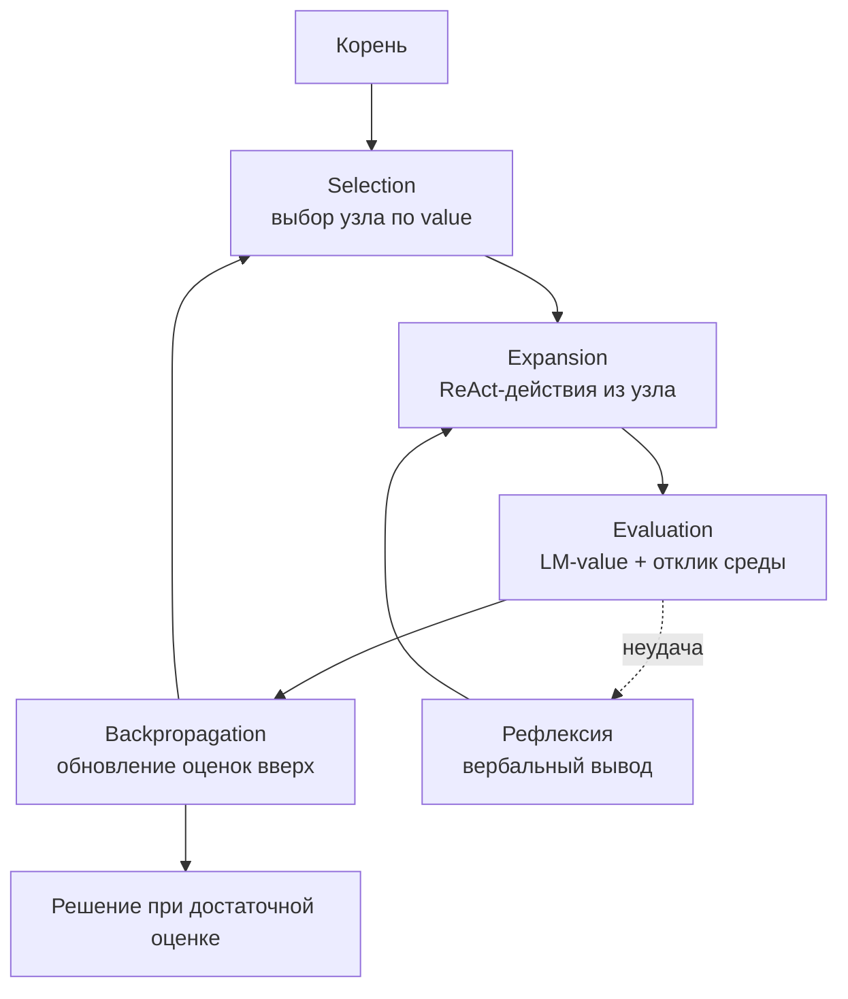

# LATS (Language Agent Tree Search)

> Поиск по дереву методом Монте-Карло поверх ReAct-траекторий: узлы оцениваются LM-value-функцией, ветки улучшаются рефлексией, а обратная связь берется из внешней среды.

## Суть

**LATS** (Zhou et al., ICML 2024) объединяет три линии группы в один алгоритм: поиск по дереву ([Tree of Thoughts](../tot/)), действия во внешней среде ([ReAct](../react/)) и словесную саморефлексию (**Reflexion**). Каркас - **MCTS** (Monte Carlo Tree Search) с четырьмя фазами: selection → expansion → evaluation → backpropagation, где:
- **узлы дерева** - это состояния агента (последовательности thought/action/observation, как в ReAct);
- **оценка узла** - LM-value-функция (модель оценивает перспективность состояния) плюс **реальная обратная связь среды** (результаты инструментов, тесты), а не только внутренняя эвристика;
- **саморефлексия** - после неудачной ветви агент пишет вербальный вывод, который улучшает последующее расширение дерева.

Именно опора на **внешний сигнал** (среда, тесты) отличает LATS от чисто-внутренней оценки ToT и делает поиск заземленным. Авторы сообщают SOTA-результаты своего времени (например, pass@1 92,7% на HumanEval с GPT-4) - ценой самых больших вычислений в группе.

## Схема

Схема в отдельном файле: [`diagram.mmd`](diagram.mmd).

## Когда применять / когда не применять

**Применять, если:**
- есть **проверяемая обратная связь среды** (тесты, исполнение кода, состояние БД) - она питает оценку узлов;
- задача трудная, с необходимостью перебора и отката, и цена решения оправдывает большие вычисления;
- одиночные ReAct/ToT не дотягивают по качеству.

**Не применять, если:**
- бюджет ограничен: LATS - самый дорогой паттерн группы по вызовам;
- нет внешнего сигнала для оценки (тогда преимущество над ToT теряется);
- reasoning-модель одним-двумя вызовами дает сопоставимый результат.

## Компромиссы

- **Качество vs стоимость.** Максимальная точность в группе ценой максимальных вычислений (MCTS × ReAct × рефлексия).
- **Заземленность.** Опора на среду делает оценку надежнее, чем чистая внутренняя эвристика ToT.
- **Сложность.** Нужен MCTS-движок, value-функция и цикл рефлексии - самая тяжелая реализация группы.
- **Латентность.** Много последовательных развертываний дерева с реальными вызовами инструментов.

## Вариации и развитие

- **[Tree of Thoughts](../tot/)** - дерево без MCTS, без действий во внешней среде и без рефлексии.
- **[ReAct](../react/)** - одна траектория thought/action/observation; LATS ищет по дереву таких траекторий.
- **Reflexion** - механизм саморефлексии, встроенный в оценку и расширение узлов LATS.

## Реализации

- **Схема без кода:** LATS - это полноценный MCTS-агент с value-функцией и рефлексией; минимальным «сырым» примером суть честно не передать. Здесь только схема; рабочая реализация есть в LangGraph и в референсе авторов.

## Источники

- Zhou et al. «Language Agent Tree Search Unifies Reasoning, Acting, and Planning in Language Models», ICML 2024 - arXiv:2310.04406.
- Сводка по группе: [`../README.md`](../README.md).

## Мои заметки

- Проверить, есть ли в задаче дешевый и надежный внешний сигнал (тесты) - без него LATS теряет главное преимущество над ToT.
