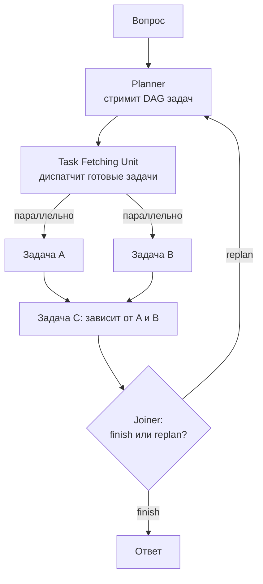

# LLMCompiler

> Планировщик выдает граф задач с зависимостями, а исполнитель запускает независимые задачи параллельно по мере готовности - экономия не токенов, а латентности.

## Суть

**LLMCompiler** (Kim et al., 2023) берет идею «спланировать заранее» из [ReWOO](../rewoo/) и добавляет к ней **параллелизм по зависимостям**. Аналогия - компилятор, который из программы строит граф вычислений и исполняет независимые ветви одновременно.

Три компонента:
- **Planner** - стримит **DAG задач**: каждая задача - вызов инструмента, ребра - зависимости (аргумент одной задачи ссылается на результат другой).
- **Task Fetching Unit** - как только зависимости задачи готовы, отправляет ее на исполнение; независимые задачи идут **параллельно**.
- **Joiner** - смотрит на собранные результаты и решает: закончить и дать ответ или **перепланировать** (динамический реплан).

Главный выигрыш - **латентность и стоимость** за счет распараллеливания: авторы заявляют ускорение до ~3,6× и снижение расхода токенов против ReAct на задачах с независимыми под-вызовами. Это ключевое отличие от ReWOO: тот экономит токены (2 вызова), но исполняет по зависимостям без явной оптимизации параллелизма; LLMCompiler явно строит DAG ради скорости.

## Схема

Схема в отдельном файле: [`diagram.mmd`](diagram.mmd).

## Когда применять / когда не применять

**Применять, если:**
- в задаче много **независимых** под-вызовов (их можно распараллелить);
- критична латентность, а не только стоимость;
- зависимости между шагами известны и выразимы графом.

**Не применять, если:**
- шаги строго последовательны (параллелить нечего - проще [ReWOO](../rewoo/));
- путь непредсказуем и меняется каждый шаг - тогда [ReAct](../react/);
- накладные расходы на построение и диспетчеризацию DAG не окупаются на короткой задаче.

## Компромиссы

- **Латентность.** Главный выигрыш: независимые ветви исполняются одновременно (до ~3,6× по заявлению авторов).
- **Стоимость.** Меньше вызовов LLM, чем у ReAct; Planner + Joiner вместо вызова на каждый шаг.
- **Сложность реализации.** Нужен планировщик, умеющий выражать DAG, и рантайм с параллельным исполнением и учетом зависимостей - заметно сложнее линейного ReWOO.
- **Хрупкость плана** частично лечится Joiner'ом (реплан), но по-прежнему опирается на качество исходного DAG.

## Вариации и развитие

- **[ReWOO](../rewoo/)** - тот же «план заранее», но без явного параллелизма; оптимизирует токены, а не латентность.
- **[Plan-and-Execute](../plan-and-execute/)** - пошаговое исполнение с репланом; проще, но последовательно.
- **[ReAct](../react/)** - противоположность: без общего плана и без параллелизма, зато максимально адаптивно.

## Реализации

- **Схема без кода:** честный минимальный пример потребовал бы асинхронного планировщика DAG и параллельного рантайма - это уже инфраструктура, а не «суть в 40 строк». Поэтому здесь только схема; рабочую реализацию смотрите в LangGraph (`LLMCompiler`) и в референсе авторов.

## Источники

- Kim et al. «An LLM Compiler for Parallel Function Calling», 2023 - arXiv:2312.04511.
- Сводка по группе: [`../README.md`](../README.md).

## Мои заметки

- Оценить на своей задаче долю независимых под-вызовов: если их мало, параллелизм LLMCompiler не окупит сложность.
