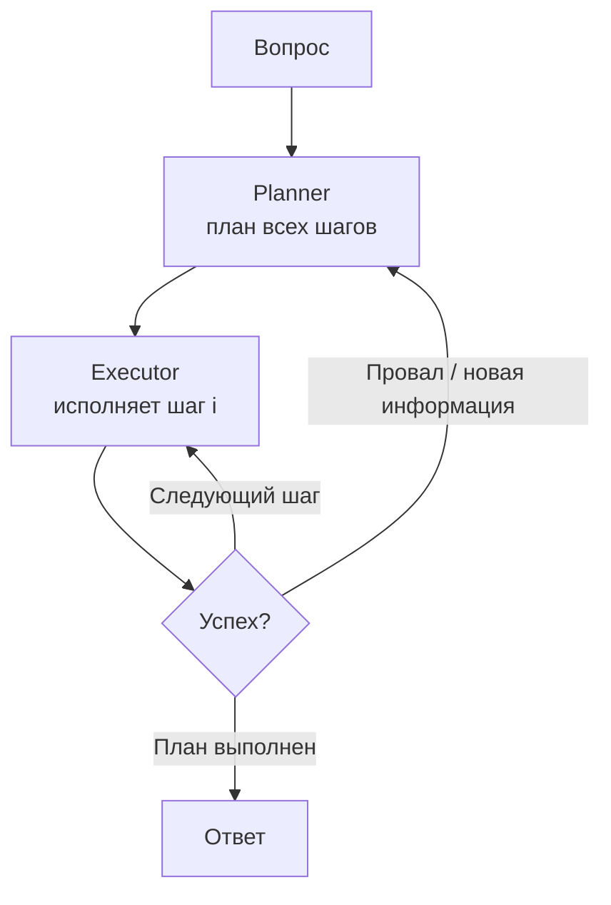

# Plan-and-Execute

> Планировщик строит весь многошаговый план заранее, исполнитель проходит его по шагам (часто дешевой моделью) и перестраивает остаток плана при сбое.

## Суть

**Plan-and-Execute** (и близкий **Plan-and-Solve**, Wang et al., ACL 2023) отделяет **планирование** от **исполнения**. Сначала Planner один раз строит явный многошаговый план всей задачи - в отличие от близорукого [ReAct](../react/), который выбирает лишь следующий шаг и не видит задачу целиком. Затем Executor исполняет шаги по одному; поскольку исполнение обычно проще планирования, его часто выносят на более дешевую/быструю модель.

Ключевое отличие от [ReWOO](../rewoo/): план здесь **не заморожен** плейсхолдерами. Исполнение идет с настоящими наблюдениями, и если шаг провалился или всплыла новая информация - Planner **перестраивает оставшийся план** (replan). Это компромисс между жесткостью ReWOO (дешево, но ломается на неожиданностях) и дороговизной ReAct (адаптивно, но вызов LLM на каждый шаг): дорогой планировщик зовут редко, а адаптивность сохраняется через реплан.

## Схема

Схема в отдельном файле: [`diagram.mmd`](diagram.mmd).

## Когда применять / когда не применять

**Применять, если:**
- задача декомпозируется на явные шаги, но по ходу возможны сбои → нужен реплан;
- планирование хочется отделить от исполнения и вынести исполнение на дешевую модель;
- полезно инспектировать весь план до старта.

**Не применять, если:**
- путь совсем непредсказуем и меняется каждый шаг - тогда [ReAct](../react/);
- план заведомо не ломается и наблюдения не нужны - тогда дешевле [ReWOO](../rewoo/) (2 вызова, без реплана);
- задача детерминирована и без инструментов - это workflow, а не агент.

## Компромиссы

- **Стоимость.** Меньше вызовов дорогого планировщика, чем у ReAct; исполнение - на дешевой модели. Но реплан добавляет вызовы, и при частых сбоях выигрыш тает.
- **Адаптивность vs жесткость.** Гибче ReWOO (есть реплан), но все равно опирается на начальный план: плохой план тянет за собой лишние циклы реплана.
- **Инспектируемость.** План виден до исполнения - легче проверить и вмешаться (в т.ч. HITL перед стартом).
- **Латентность.** Шаги исполняются последовательно; параллелизма по зависимостям нет (это делает LLMCompiler).

## Вариации и развитие

- **[ReWOO](../rewoo/)** - крайний случай без реплана: план с плейсхолдерами, 2 вызова, максимум экономии, минимум адаптивности.
- **[LLMCompiler](../llm-compiler/)** - планирует DAG и исполняет независимые шаги параллельно (ускорение, а не только экономия).
- **[ReAct](../react/)** - без общего плана, наблюдение и решение на каждом шаге.
- **evaluator-optimizer** (группа 04) - родственная идея цикла «сделать → проверить → переделать», но с независимым критиком качества, а не репланом по факту сбоя.

## Реализации

- **Без фреймворков:** [`example.py`](example.py) - Planner строит список шагов, Executor исполняет их по одному с инструментом, при сигнале о неудаче зовет Planner для реплана остатка.
- **Фреймворки:** конструкция `plan-and-execute` есть в LangGraph. Держим отдельно от «сырого» примера.

## Источники

- Wang et al. «Plan-and-Solve Prompting…», ACL 2023 - arXiv:2305.04091.
- Сводка по группе: [`../README.md`](../README.md).

## Мои заметки

- Проверить, какую долю задач вытягивает один план без реплана - и оправдан ли реплан по стоимости.
- Сравнить качество/цену с ReWOO на одной задаче: где жесткость ломается, а реплан спасает.
