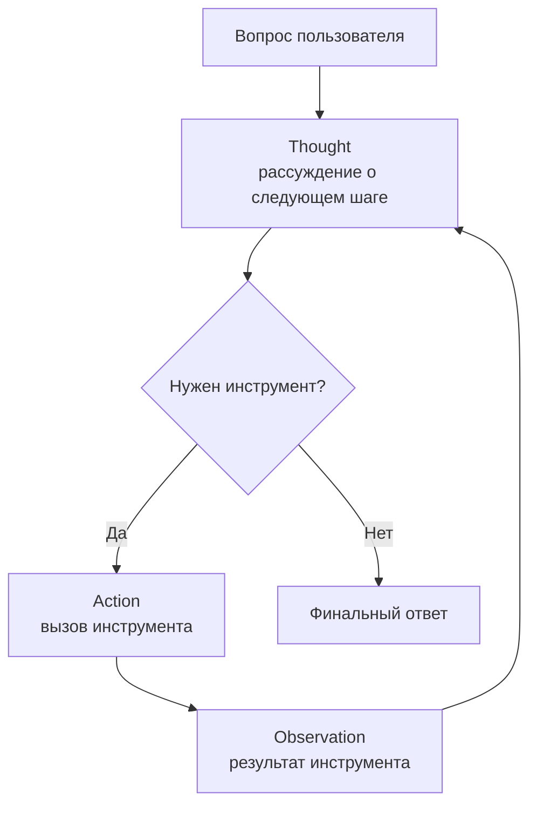

# ReAct

> Агент чередует рассуждение и действие в цикле Thought → Action → Observation, опираясь на обратную связь среды вместо одной линейной догадки.

## Суть

**ReAct** (Reasoning + Acting, Yao et al., ICLR 2023) объединяет два ранее раздельных режима: пошаговое рассуждение в тексте (как в CoT) и вызов инструментов. На каждом шаге агент пишет **Thought** (короткое рассуждение о том, что делать дальше), выполняет **Action** (вызов инструмента) и получает **Observation** (результат инструмента), который попадает обратно в контекст. Цикл повторяется, пока модель не сочтет, что информации достаточно для финального ответа.

Ключевая идея - **заземление рассуждения на реальную обратную связь**. Чистый CoT рассуждает по одной линейной траектории и не может проверить промежуточные факты, поэтому ранняя ошибка необратима и ведет к галлюцинации. ReAct на каждом шаге сверяется с внешним миром (поиск, вычисление, API), что снижает число выдуманных фактов и делает траекторию корректируемой.

ReAct - практический **дефолт для агента с инструментами**. В современных SDK он реализуется не парсингом текста, а нативным function/tool calling: «Thought» - это текстовый блок перед вызовом, «Action» - блок `tool_use`, «Observation» - блок `tool_result`, отправляемый обратно.

## Схема

Схема в отдельном файле: [`diagram.mmd`](diagram.mmd).

## Когда применять / когда не применять

**Применять, если:**
- задача требует внешних данных или действий (поиск, вычисления, API, файлы);
- путь решения заранее не известен и зависит от промежуточных результатов;
- нужна адаптивность: следующий шаг выбирается по факту наблюдений.

**Не применять, если:**
- задача решается одним вызовом без инструментов (тогда - CoT или просто хороший промпт);
- инструментов много и стоимость критична - рассмотрите [ReWOO](../rewoo/) или [Plan-and-Execute](../plan-and-execute/) (меньше LLM-вызовов);
- используется reasoning-модель, которая уже интернализует переключение thought/action - лишний ReAct-скаффолд может мешать (см. оговорку в [`taxonomy.md`](../../../taxonomy.md#ключевой-сдвиг-20252026)).

## Компромиссы

- **Стоимость.** Один LLM-вызов на каждый шаг цикла. На длинных цепочках (десятки шагов) это дорого и медленно - здесь ReWOO с его 2 вызовами экономит до ~5× токенов.
- **Латентность.** Шаги строго последовательны: следующий вызов зависит от предыдущего наблюдения, параллелизма нет (в отличие от LLMCompiler с DAG задач).
- **«Близорукость».** Классический ReAct планирует на один шаг вперед и не делает бэктрекинг - при плохом раннем выборе может «застрять». Деревья ([ToT](../tot/), [LATS](../lats/)) это лечат ценой резкого роста вычислений.
- **Надежность выше, чем у CoT**, именно за счет заземления на обратную связь среды, но зависит от качества инструментов и их описаний (см. ACI ниже).

## Вариации и развитие

- **[ReWOO](../rewoo/)** - отделяет план от наблюдений: план с плейсхолдерами строится заранее, инструменты исполняются пакетно, поздняя интеграция; всего 2 LLM-вызова.
- **[Plan-and-Execute](../plan-and-execute/)** - план всех шагов заранее, затем исполнение (часто дешевой моделью), реплан при сбое.
- **[Reflexion](../reflexion/)** - надстройка над ReAct: после неудачной попытки агент пишет саморефлексию в эпизодическую память и учитывает ее в следующей попытке.
- **[LATS](../lats/)** - поиск по дереву (MCTS) поверх ReAct-траекторий с value-функциями и рефлексией.

## Реализации

- **Без фреймворков:** минимальный цикл на голом Anthropic Messages API - [`example.py`](example.py). Это и есть суть паттерна: `messages.create(..., tools=...)` в цикле, пока `stop_reason == "tool_use"`.
- **Фреймворки:** LangGraph (`create_react_agent`), LlamaIndex (`ReActAgent`), OpenAI Agents SDK. Устаревают быстрее - держим отдельно от «сырого» примера.

Совет Anthropic: инвестируйте в **agent-computer interface (ACI)** - понятные описания инструментов, форматы аргументов, примеры, poka-yoke-параметры - столько же, сколько в UX для людей. Качество ReAct-агента во многом определяется качеством описаний инструментов.

## Источники

- Yao et al. «ReAct: Synergizing Reasoning and Acting in Language Models», ICLR 2023 - arXiv:2210.03629.
- Anthropic, «Building effective agents» (19 декабря 2024) - про ACI и порог перехода к агентам.
- См. также сводку по группе: [`../README.md`](../README.md).

## Мои заметки

- Проверить на своей задаче: где проходит порог, за которым ReWOO/Plan-and-Execute выгоднее ReAct по стоимости.
- Идея для эксперимента: сравнить нативный tool-calling ReAct и reasoning-модель с минимальным скаффолдом на одной задаче с инструментами.
