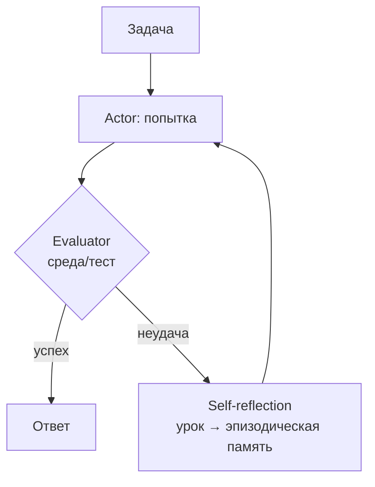

# Reflexion

> После неудачной попытки агент пишет о ней короткий вербальный вывод, кладет его в эпизодическую память и учитывает в следующей попытке - обучение без обновления весов.

## Суть

**Reflexion** (Shinn et al., NeurIPS 2023) - «вербальное обучение с подкреплением». Агент делает попытку решить задачу; внешний сигнал (тест, среда, проверка) говорит «успех/неудача»; при неудаче агент формулирует **саморефлексию** - что пошло не так и что сделать иначе - и записывает ее в **эпизодическую память**. На следующей попытке рефлексия лежит в контексте и корректирует поведение. Веса модели не трогаются: «обучение» происходит через накопленный текст.

Три роли в цикле:
- **Actor** - делает попытку (часто это [ReAct](../react/)-агент);
- **Evaluator** - дает сигнал успеха/неудачи (тесты, среда, эвристика);
- **Self-reflection** - превращает сигнал в вербальный урок для памяти.

Критично, что триггер рефлексии - **внешняя обратная связь**, а не только самооценка: это отличает Reflexion от чисто-интроспективного [Self-Refine](../self-refine/) и роднит с [CRITIC](../critic/). Авторы сообщают заметный прирост (например, ~91% pass@1 на HumanEval) именно за счет итеративного накопления уроков.

## Схема

Схема в отдельном файле: [`diagram.mmd`](diagram.mmd).

## Когда применять / когда не применять

**Применять, если:**
- есть **проверяемый внешний сигнал** (тесты, состояние среды), запускающий рефлексию;
- задача допускает несколько попыток, и уроки прошлых попыток переносимы;
- одиночная попытка (ReAct/CoT) систематически не дотягивает.

**Не применять, если:**
- нет надежного сигнала успеха/неудачи - рефлексия «в пустоту» ненадежна (см. предупреждение про intrinsic self-correction в [CRITIC](../critic/));
- задача одноразовая и повтор недопустим;
- бюджет не позволяет несколько попыток.

## Компромиссы

- **Точность vs стоимость.** Каждая итерация - новая попытка + рефлексия; прирост качества ценой ×(числа попыток).
- **Зависимость от сигнала.** Все держится на качестве Evaluator: без честной оценки уроки бесполезны или вредны.
- **Память.** Нужна эпизодическая память (накопление уроков) - это мост к [группе 03](../../03-memory-context/); при переполнении контекста уроки суммаризуют.
- **Риск «отравления».** Неверный урок, записанный в память, будет мешать последующим попыткам.

## Вариации и развитие

- **[Self-Refine](../self-refine/)** - та же идея цикла, но без внешнего сигнала: критика чисто интроспективная.
- **[CRITIC](../critic/)** - коррекция с опорой на внешние инструменты (поиск, интерпретатор), а не только на рефлексию.
- **[LATS](../lats/)** - встраивает рефлексию в оценку и расширение узлов дерева поиска.
- **[ReAct](../react/)** - типичный Actor внутри Reflexion.

## Реализации

- **Без фреймворков:** [`example.py`](example.py) - цикл «попытка → проверка детерминированным чекером → рефлексия в память → повтор» на маленькой задаче с внешним сигналом.
- **Фреймворки:** reflexion-петли есть в LangGraph. Держим отдельно от «сырого» примера.

## Источники

- Shinn et al. «Reflexion: Language Agents with Verbal Reinforcement Learning», NeurIPS 2023 - arXiv:2303.11366.
- Сводка по группе: [`../README.md`](../README.md).

## Мои заметки

- Проверить, что Evaluator дает честный сигнал: без него Reflexion вырождается в ненадежную самокоррекцию.
- Продумать политику памяти: сколько уроков хранить и как чистить ошибочные.
