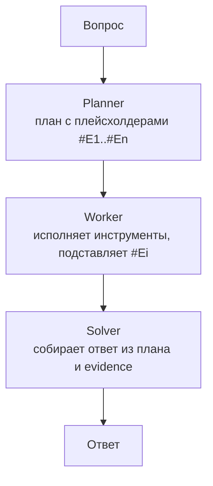

# ReWOO

> План с плейсхолдерами строится один раз, инструменты исполняются пакетно, ответ собирается в конце - всего 2 LLM-вызова независимо от числа инструментов.

## Суть

**ReWOO** (Reasoning WithOut Observation, Xu et al., 2023) устраняет главный источник затрат [ReAct](../react/): там результат каждого инструмента (Observation) вклеивается в контекст и переотправляется со следующим вызовом, а на каждый шаг тратится отдельный вызов LLM. На длинных цепочках это дает квадратичный рост токенов.

ReWOO разрывает связку «рассуждение ↔ наблюдение», разбивая работу на три модуля:
- **Planner** - один вызов LLM строит весь план заранее: последовательность шагов, где результат i-го инструмента обозначен плейсхолдером `#E1`, `#E2`… На эти плейсхолдеры можно ссылаться в аргументах следующих шагов (так кодируются зависимости).
- **Worker** - без LLM: исполняет инструменты, подставляя вместо `#Ei` реальные результаты предыдущих шагов.
- **Solver** - один вызов LLM: собирает финальный ответ из плана и собранных evidence.

Итого **2 LLM-вызова** (Planner + Solver) независимо от числа инструментов; авторы заявляют до ~5× экономии токенов против ReAct при сопоставимом качестве. Бонус: план фиксируется **до** контакта с данными инструментов - это же основа паттерна безопасности *plan-then-execute* (группа 07).

## Схема

Схема в отдельном файле: [`diagram.mmd`](diagram.mmd).

## Когда применять / когда не применять

**Применять, если:**
- инструментов много и стоимость/латентность критичны;
- план предсказуем и декомпозируем заранее, до контакта с данными;
- нужна экономия токенов и/или дешевая модель на исполнении.

**Не применять, если:**
- путь зависит от промежуточных наблюдений (инструмент может вернуть неожиданное - план сломается);
- среда нестабильна и нужна реакция на ошибки по ходу - тогда [ReAct](../react/) или [Plan-and-Execute](../plan-and-execute/) (с репланом);
- задача решается без инструментов (CoT достаточно).

## Компромиссы

- **Стоимость.** 2 вызова вместо N - главный выигрыш; Solver можно вынести на более дешевую модель.
- **Латентность.** Независимые шаги плана Worker может исполнять параллельно; строго последовательен только там, где есть зависимости через `#Ei`.
- **Хрупкость - главный минус.** План фиксируется до наблюдений: если инструмент вернул не то, что ожидал Planner, исправить это уже негде (нет обратной связи среды). ReAct в этом месте адаптивнее, Plan-and-Execute - восстанавливается репланом.
- **Инспектируемость.** Весь план виден до старта - легко проверить и закешировать.

## Вариации и развитие

- **[Plan-and-Execute](../plan-and-execute/)** - снимает жесткость ReWOO: исполняет пошагово и **перестраивает план при сбое** (реплан), ценой лишних вызовов планировщика.
- **LLMCompiler** - планировщик стримит DAG задач, а исполнитель запускает их параллельно по мере готовности зависимостей (ускорение вместо только экономии).
- **[ReAct](../react/)** - противоположный конец оси: наблюдение на каждом шаге, максимум адаптивности, максимум вызовов.

## Реализации

- **Без фреймворков:** [`example.py`](example.py) - Planner (1 вызов) → Worker (парсит план, исполняет инструменты, подставляет `#Ei`) → Solver (1 вызов). Ровно 2 обращения к LLM.
- **Фреймворки:** пример ReWOO есть в LangGraph. Устаревает быстрее - держим отдельно от «сырого» примера.

## Источники

- Xu et al. «ReWOO: Decoupling Reasoning from Observations for Efficient Augmented Language Models», 2023 - arXiv:2305.18323.
- Сводка по группе: [`../README.md`](../README.md).

## Мои заметки

- Замерить реальную экономию токенов ReWOO vs ReAct на своей задаче с 5+ инструментами.
- Проверить типичный режим поломки: как часто план ломается из-за неожиданного результата инструмента и стоит ли добавлять реплан (тогда это уже Plan-and-Execute).
