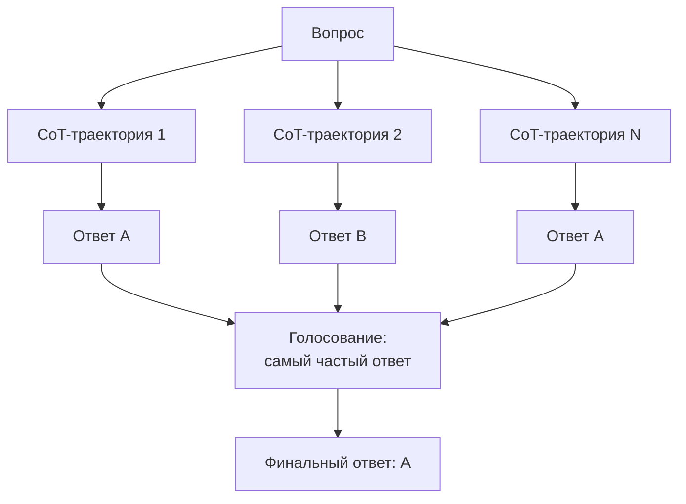

# Self-Consistency

> Вместо одной цепочки рассуждения сэмплируем несколько независимых и берем самый частый ответ - маргинализация по траекториям поднимает точность там, где одиночный CoT ошибается.

## Суть

**Self-Consistency** (Wang et al., ICLR 2023) - надстройка над [Chain-of-Thought](../cot/): один и тот же вопрос прогоняется через модель N раз, каждый раз получается своя цепочка рассуждения и свой ответ, а итог выбирается **голосованием** (самый частый ответ). Идея - правильный ответ достижим многими разными путями рассуждения, а ошибки расходятся по-разному; поэтому мода по выборке ответов устойчивее одной траектории.

Формально это **маргинализация**: мы усредняем не рассуждения, а финальные ответы, отбрасывая путь как латентную переменную. Работает лучше всего там, где ответ дискретен и легко сравним (число, метка класса, короткая строка).

Ключевое отличие от одиночного CoT - не «думать дольше», а «подумать по-разному несколько раз и свериться с собой». Это первый шаг вверх по лестнице «формы поиска»: от линейной цепочки к выборке с голосованием.

## Схема

Схема в отдельном файле: [`diagram.mmd`](diagram.mmd).

## Когда применять / когда не применять

**Применять, если:**
- ответ дискретен и сравним (арифметика, классификация, короткий факт);
- цена ошибки высока и оправдывает ×N вызовов;
- задача такая, что верный ответ достижим несколькими путями рассуждения.

**Не применять, если:**
- ответ - длинный свободный текст (голосовать не по чему; нужен evaluator-optimizer или иная агрегация);
- бюджет критичен: стоимость растет линейно с числом сэмплов;
- используется reasoning-модель, где прирост от внешнего голосования может не окупать N-кратную цену (внутреннее рассуждение уже устойчиво).

## Компромиссы

- **Стоимость.** Линейно ×N по числу сэмплов - главный минус. Обычно берут небольшой N (5-40 в оригинале), дальше отдача падает.
- **Точность.** Заметный прирост на арифметике/логике поверх CoT именно за счет устойчивости моды к случайным ошибкам.
- **Разнообразие траекторий - обязательное условие.** Если все сэмплы одинаковы, голосовать бессмысленно. Классически разнообразие давала температура сэмплинга; на современных reasoning-моделях параметр `temperature` недоступен, и разброс обеспечивается стохастичностью декодирования - это ослабляет эффект (см. заметку в [`example.py`](example.py)).
- **Только агрегация ответа.** Self-Consistency не исправляет рассуждение и не сверяется с внешним миром - он лишь выбирает моду. Для проверки фактов нужен [ReAct](../react/) или CRITIC.

## Вариации и развитие

- **[Chain-of-Thought](../cot/)** - базовый слой: одна траектория, которую здесь сэмплируют многократно.
- **[ToT](../tot/) / [GoT](../got/)** - вместо независимого голосования строят дерево/граф мыслей с явной оценкой и переиспользованием ветвей.
- **Voting-параллелизация** (workflow-паттерн Anthropic) - та же идея консенсуса, но на уровне оркестрации нескольких промптов (напр., проверка кода несколькими независимыми прогонами).
- **Weighted / verifier-based** варианты - взвешивают голоса уверенностью или внешним верификатором вместо простого большинства.

## Реализации

- **Без фреймворков:** [`example.py`](example.py) - N независимых CoT-прогонов, парсинг финального ответа, голосование `Counter.most_common`.
- **Промптинг:** тот же CoT-промпт, что и в одиночном случае; вся «магия» - во внешнем цикле сэмплирования и подсчете голосов.

## Источники

- Wang et al. «Self-Consistency Improves Chain of Thought Reasoning in Language Models», ICLR 2023 - arXiv:2203.11171.
- Сводка по группе: [`../README.md`](../README.md).

## Мои заметки

- Замерить на своей задаче кривую «точность vs N»: где выходит на плато и оправдан ли ×N.
- Проверить, дает ли reasoning-модель без `temperature` достаточный разброс траекторий, чтобы голосование вообще имело смысл.
