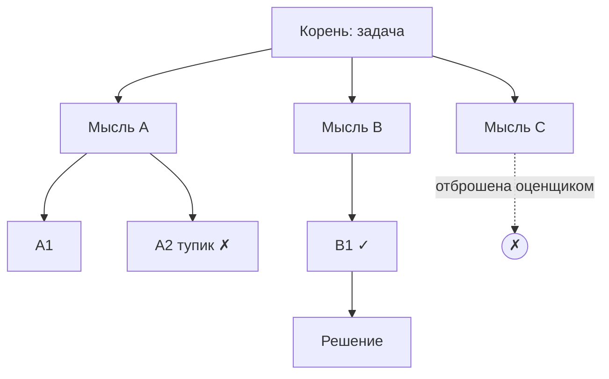

# Tree of Thoughts (ToT)

> Рассуждение ветвится в дерево: узлы-мысли оцениваются эвристикой, поиск идет с бэктрекингом - для задач, где важны просмотр вперед и откат от тупиковой ветки.

## Суть

**Tree of Thoughts** (Yao et al., NeurIPS 2023) обобщает [Chain-of-Thought](../cot/) с линейной цепочки на **дерево**. На каждом шаге генерируется несколько кандидатов-«мыслей» (частичных решений), они оцениваются, и поиск идет по дереву - BFS или DFS - с возможностью **бэктрекинга**: зайдя в тупик, агент откатывается и пробует другую ветку.

Три составляющие:
- **Декомпозиция мысли** - что считать одним шагом/узлом (строка, уравнение, ход);
- **Генератор** - предлагает несколько продолжений из узла;
- **Оценщик** - эвристикой (обычно самой LLM) оценивает перспективность узла: «solve / likely / impossible» либо числовой скор, задавая порядок обхода.

Отличие от [Self-Consistency](../self-consistency/): та сэмплирует независимые полные траектории и голосует по финальным ответам; ToT строит **явное дерево** с оценкой промежуточных состояний и откатом. ToT силен там, где решение требует lookahead и где ранний неверный шаг иначе необратим (игра «24», планирование, творческие задачи с ограничениями).

## Схема

Схема в отдельном файле: [`diagram.mmd`](diagram.mmd).

## Когда применять / когда не применять

**Применять, если:**
- есть **проверяемые промежуточные состояния**, которые можно оценивать и сравнивать;
- задача выигрывает от просмотра вперед и отката (перебор, головоломки, планирование с ограничениями);
- цена решения оправдывает резкий рост вычислений.

**Не применять, если:**
- задача решается линейно (CoT) или голосованием (Self-Consistency) - дерево избыточно;
- нет вменяемой оценки промежуточных узлов (оценщик шумит - поиск деградирует);
- reasoning-модель одним вызовом дает сопоставимое качество: тогда явное дерево часто не нужно (см. [`taxonomy.md`](../../../taxonomy.md#ключевой-сдвиг-20252026)).

## Компромиссы

- **Точность vs вычисления.** Дерево дает прирост на трудных задачах ценой **экспоненциального** роста числа вызовов (ширина × глубина).
- **Зависимость от оценщика.** Весь выигрыш держится на качестве оценки узлов; плохой оценщик превращает поиск в дорогой случайный перебор.
- **Латентность.** Много последовательных вызовов LLM (генерация + оценка на каждом узле).
- **Реализуемость.** Нужен явный контроль дерева (границы ширины/глубины, стратегия обхода) - сложнее линейных паттернов.

## Вариации и развитие

- **[Chain-of-Thought](../cot/)** - вырожденный случай: дерево ширины 1 без оценки и отката.
- **[Self-Consistency](../self-consistency/)** - «плоский» перебор без дерева: N независимых траекторий + голосование.
- **[Graph of Thoughts](../got/)** - обобщает дерево до графа: ветви можно агрегировать и переиспользовать.
- **[LATS](../lats/)** - добавляет к дереву MCTS, действия во внешней среде и рефлексию.

## Реализации

- **Схема без кода:** честная реализация ToT - это менеджер дерева со стратегией обхода и оценкой узлов; это уже не «суть в 40 строк». Здесь только схема; рабочие реализации - в LangGraph и референсе авторов.

## Источники

- Yao et al. «Tree of Thoughts: Deliberate Problem Solving with Large Language Models», NeurIPS 2023 - arXiv:2305.10601.
- Сводка по группе: [`../README.md`](../README.md).

## Мои заметки

- Проверить на своей задаче: дает ли reasoning-модель одним вызовом качество, сопоставимое с явным ToT - если да, дерево не нужно.
- Ключевой риск - оценщик узлов: измерить, насколько его скор коррелирует с реальной перспективностью ветки.
