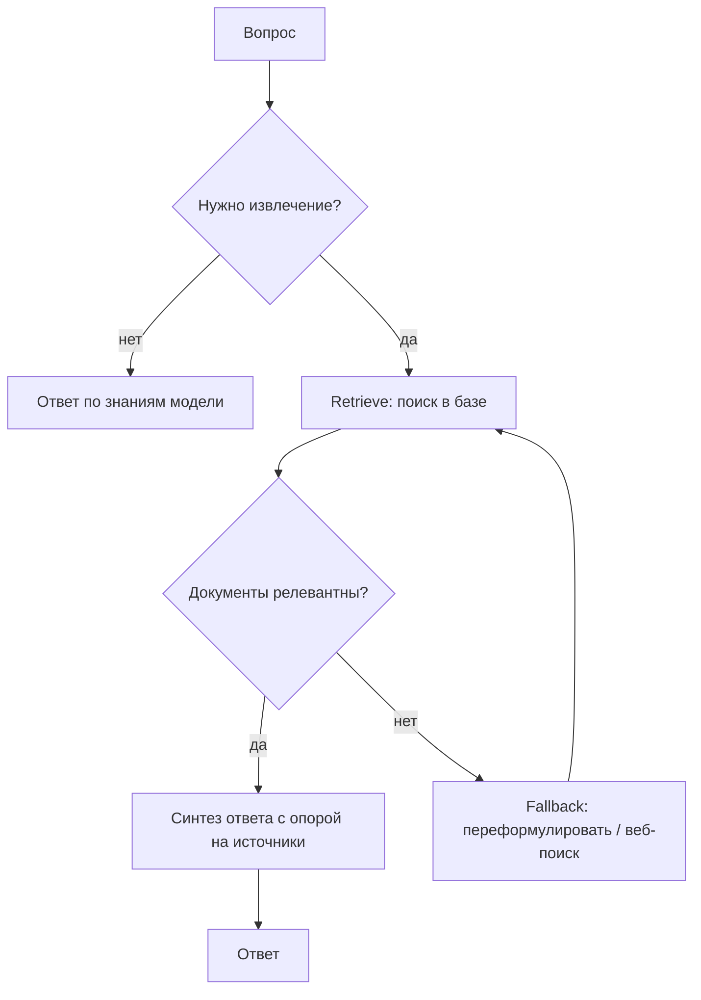

# Agentic RAG

> Извлечение знаний управляется решениями агента: когда искать, что переспросить, доверять ли документу - вместо «всегда достать топ-k и вклеить в промпт».

## Суть

Классический RAG жестко зашит: на каждый запрос достаем топ-k документов и подаем модели. **Agentic RAG** делает извлечение **решением агента**: модель сама решает, нужен ли поиск вообще, формулирует запрос, оценивает релевантность найденного и при необходимости переспрашивает или уходит в другой источник. По сути это [function calling](../function-calling/), где один из инструментов - retrieval, а вокруг него крутится [ReAct](../../01-reasoning/react/)-подобный цикл с само-оценкой.

Два опорных подхода:
- **Self-RAG** (Asai et al., ICLR 2024) - модель обучена испускать **reflection-токены**, которые управляют процессом: *нужно ли извлечение*, *релевантен ли документ*, *подкреплен ли ответ источником*. Извлечение и критика становятся частью генерации.
- **CRAG (Corrective RAG)** - легкий оценщик релевантности сортирует извлеченное на «верно / неверно / неоднозначно»; при плохих документах включается **fallback** (например, веб-поиск) и переформулировка запроса.

Главный сдвиг относительно обычного RAG - **обратная связь и коррекция**: плохое извлечение не отравляет ответ молча, а распознается и исправляется.

## Схема

Схема в отдельном файле: [`diagram.mmd`](diagram.mmd).

## Когда применять / когда не применять

**Применять, если:**
- часть запросов не требует извлечения, а часть - многошагового (решает агент, а не жесткий пайплайн);
- качество источников неровное и нужна оценка релевантности + fallback;
- один проход «достать топ-k» дает слабые ответы (нужны переформулировка/несколько источников).

**Не применять, если:**
- база маленькая и однородная, классический RAG стабильно попадает - агентность лишь добавит вызовов и латентность;
- запрос всегда требует одного и того же извлечения (тогда это workflow, а не агент).

## Компромиссы

- **Точность vs стоимость/латентность.** Оценка релевантности, переформулировки и fallback дают более верные ответы ценой лишних вызовов LLM и поиска.
- **Надежность извлечения.** Явная само-оценка снижает «отравление» ответа нерелевантными документами - главный выигрыш против наивного RAG.
- **Сложность.** Нужны политика извлечения, оценщик релевантности и fallback-ветка; больше движущихся частей.
- **Зависимость от оценщика.** Если модель плохо судит релевантность, коррекция ломается (та же проблема, что у самокоррекции - см. [CRITIC](../../01-reasoning/critic/)).

## Вариации и развитие

- **[Function calling](../function-calling/)** - механизм под retrieval-инструментом.
- **[ReAct](../../01-reasoning/react/)** - цикл, в который встраивается «поиск как действие».
- **Память и извлечение** (группа 03) - политика извлечения и хранилище: «отделяйте retrieval-политику от хранилища».

## Реализации

- **Без фреймворков:** [`example.py`](example.py) - модель сама решает, что искать в мок-базе через инструмент `search_kb`, оценивает найденное и при нерелевантном результате переформулирует запрос; синтез ответа только по источникам.
- **Фреймворки:** LlamaIndex, LangGraph (agentic/self-RAG графы). Держим отдельно от «сырого» примера.

## Источники

- Asai et al. «Self-RAG: Learning to Retrieve, Generate, and Critique through Self-Reflection», ICLR 2024 - arXiv:2310.11511.
- «Agentic RAG: A Survey on Agentic Retrieval-Augmented Generation», 2024 - arXiv:2501.09136.
- Сводка по группе: [`../README.md`](../README.md).

## Мои заметки

- Замерить, какой доле запросов извлечение реально нужно - если почти всем и одинаково, агентность не окупится.
- Проверить качество оценщика релевантности: без него CRAG-fallback срабатывает не там.
