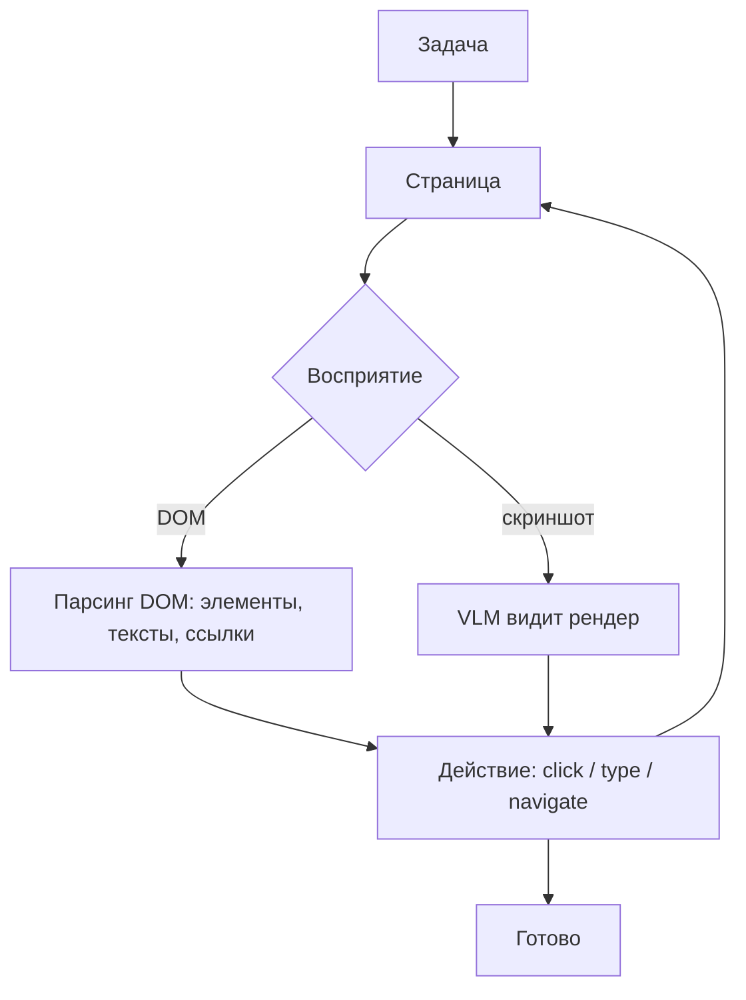

# Browser-агенты

> Агент действует в вебе: воспринимает страницу через DOM (дешево и точно) либо через скриншоты (устойчиво к динамике) и эмитит click / type / navigate.

## Суть

Browser-агент - специализация идеи [computer use](../computer-use/) под веб. Вместо всего экрана он работает с браузером и может воспринимать страницу двумя способами:
- **Через DOM** (browser-use, Stagehand): агент получает структуру страницы - элементы, тексты, ссылки, поля - и действует по ним. Дешево (меньше токенов), точно (клик по конкретному элементу, а не по координате), но **ломается на динамических приложениях** со сложным JS-рендерингом и нестабильной разметкой.
- **Через скриншоты** (VLM видит рендер): устойчивее к динамике и «нестандартной» верстке, но дороже и менее точно по попаданию в элементы.

На практике комбинируют: DOM как основной канал, скриншот - когда разметка не дает понять состояние. Действия - навигация, клик, ввод, отправка форм; наблюдение - новое состояние страницы. Это частый мост к [agentic RAG](../agentic-rag/): веб как живой источник, из которого агент достает и проверяет информацию.

## Схема

Схема в отдельном файле: [`diagram.mmd`](diagram.mmd).

## Когда применять / когда не применять

**Применять, если:**
- задача - веб-навигация/скрапинг/заполнение форм там, где нет API;
- нужен свежий веб-контент под управлением агента.

**Не применять, если:**
- есть API сервиса - он быстрее и стабильнее;
- целевые страницы агрессивно динамические и защищены от автоматизации (хрупко и дорого);
- действия необратимы без человека в петле.

## Компромиссы

- **DOM vs скриншот.** DOM дешевле и точнее, но ломается на динамике; скриншоты устойчивее, но дороже и менее точны. Выбор - по природе целевых страниц.
- **Скорость/стоимость.** Дешевле полноэкранного computer use (меньше пикселей/шагов), но все равно медленнее прямого API.
- **Безопасность.** Содержимое страниц - недоверенный ввод: prompt injection через текст на странице. Особенно опасна «lethal trifecta» (приватные данные + недоверенный контент + внешняя коммуникация) - см. [группу 07](../../07-infra-safety-eval/).

## Вариации и развитие

- **[Computer use](../computer-use/)** - обобщение на весь экран/ОС, когда браузера мало.
- **[Function calling](../function-calling/)** - если у сервиса есть API, оно предпочтительнее навигации по UI.
- **[Agentic RAG](../agentic-rag/)** - веб как источник знаний с оценкой релевантности и fallback.

## Реализации

- **Без кода в карточке:** нужен реальный браузер (Playwright и т.п.) и петля восприятие→действие; это инфраструктура, а не «суть в 40 строк». Библиотеки: browser-use, Stagehand, Playwright-обертки.

## Источники

- Инструменты browser-use, Stagehand; обзоры веб-агентов и бенчмарк WebArena (группа 07).
- Сводка по группе: [`../README.md`](../README.md).

## Мои заметки

- Определить природу целевых страниц (статика/динамика) - от нее зависит выбор DOM vs скриншот.
- Проверить injection-поверхность: что агент делает с текстом, прочитанным со страницы.
