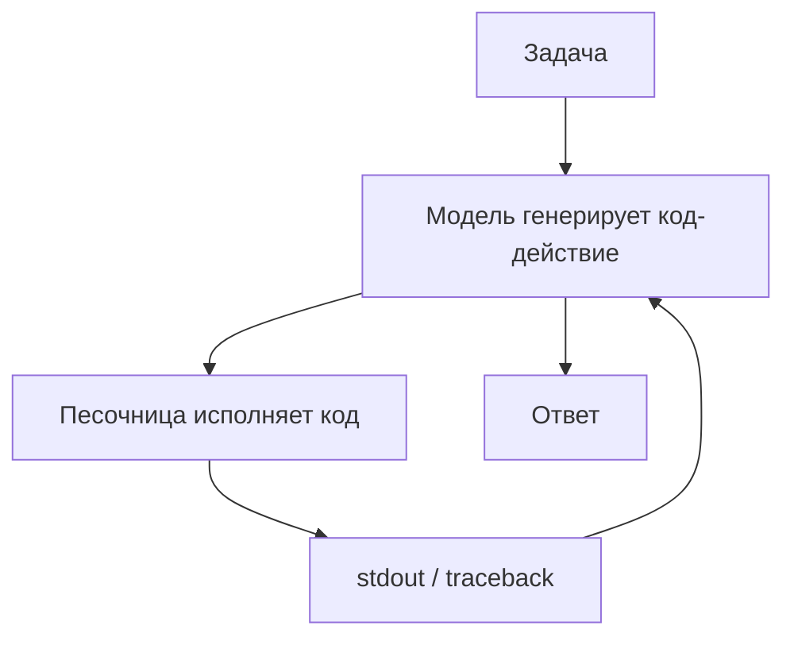

# CodeAct

> Действие агента - исполняемый код, а не JSON-вызов инструмента: модель пишет код, песочница его исполняет, а трейсбек становится обратной связью для самоотладки.

## Суть

**CodeAct** (Wang et al., ICML 2024) заменяет структурированный [function calling](../function-calling/) на **код как действие**: вместо `tool_use` с JSON-аргументами модель генерирует фрагмент (обычно Python), который исполняется в песочнице, а результат (`stdout` или `traceback`) возвращается в контекст.

Почему это мощнее JSON-вызовов:
- **Композиция.** Один фрагмент кода может вызвать несколько библиотек/функций, связать их логикой, циклами и условиями - то, что в JSON потребовало бы много отдельных вызовов.
- **Самоотладка.** Трейсбек ошибки - естественная, богатая обратная связь: модель видит исключение и правит код (родственно [Reflexion](../../01-reasoning/reflexion/), но сигнал дает интерпретатор).
- **Естественность.** Код - то, что модели видели в обучении в огромном объеме; выражать действия кодом им часто проще, чем подбирать форму JSON-вызова.

Обязательное условие - **песочница**: исполнять сгенерированный моделью код без изоляции опасно (см. [sandboxing](../../07-infra-safety-eval/)). Это главный барьер применения.

## Схема

Схема в отдельном файле: [`diagram.mmd`](diagram.mmd).

## Когда применять / когда не применять

**Применять, если:**
- задачи вычислительные или требуют композиции библиотек (данные, файлы, анализ);
- полезна самоотладка по трейсбекам;
- есть безопасная песочница исполнения.

**Не применять, если:**
- нет изоляции исполнения - риск слишком велик;
- набор действий узкий и хорошо ложится на несколько типизированных инструментов (тогда [function calling](../function-calling/) проще и безопаснее);
- нужны жесткие гарантии на состав действий (код - слишком широкая поверхность).

## Компромиссы

- **Мощность vs безопасность.** Код дает выразительность и самоотладку, но резко расширяет поверхность атаки - песочница обязательна, а не желательна.
- **Меньше оборотов.** Сложную задачу код решает за меньшее число действий, чем цепочка JSON-вызовов - экономия вызовов LLM.
- **Отладка агента.** Трейсбеки помогают модели, но и усложняют аудит: «действие» теперь произвольный код, а не выбор из списка.
- **Детерминизм состава.** В отличие от action-selector'а (группа 07), где модель лишь выбирает из фиксированного списка, CodeAct допускает почти любое действие.

## Вариации и развитие

- **[Function calling](../function-calling/)** - типизированная, более безопасная альтернатива: действие как выбор инструмента + JSON.
- **[ReAct](../../01-reasoning/react/)** - тот же цикл «действие → наблюдение», но действие здесь - код.
- **Code execution (серверные инструменты)** - управляемая реализация идеи: провайдер исполняет код в своей песочнице.

## Реализации

- **Без кода в карточке - намеренно.** Честный пример CodeAct исполняет сгенерированный моделью код; публиковать здесь запускаемый `exec` модельного кода небезопасно. Реализацию делайте только с изоляцией - см. [группу 07](../../07-infra-safety-eval/) (sandboxing) и серверный code-execution в SDK.

## Источники

- Wang et al. «Executable Code Actions Elicit Better LLM Agents», ICML 2024 - arXiv:2402.01030.
- Сводка по группе: [`../README.md`](../README.md).

## Мои заметки

- Прежде чем внедрять CodeAct - решить вопрос песочницы; без нее паттерн неприменим.
- Сравнить на своей задаче число действий CodeAct vs цепочка function calling.
