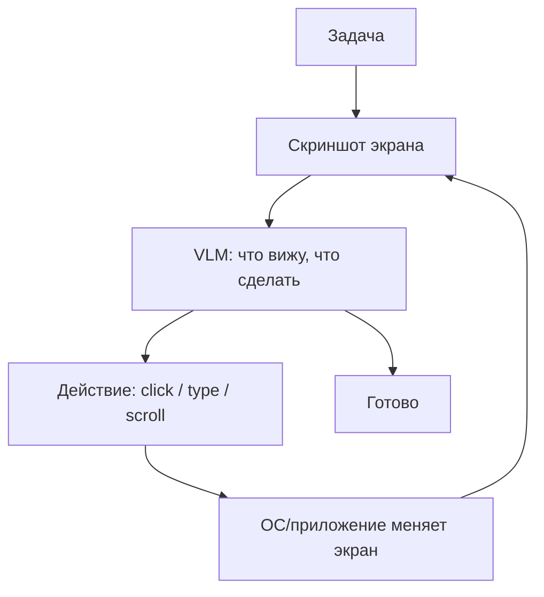

# Computer use / GUI-агенты

> Агент управляет компьютером как человек: VLM смотрит на скриншот экрана и эмитит действия мыши и клавиатуры (click / type / scroll) - универсальный доступ там, где нет API.

## Суть

**Computer use** снимает требование «у всего должен быть API»: вместо вызова функции агент работает через тот же интерфейс, что и человек. Vision-language-модель получает **скриншот**, решает, что сделать, и возвращает **действие** в координатах экрана (клик, ввод текста, прокрутка); ОС/приложение исполняют его, экран меняется, цикл повторяется. Это [function calling](../function-calling/), где инструменты - примитивы GUI, а «наблюдение» - новый скриншот.

Ключевые системы: Anthropic Computer Use (бета, окт. 2024), OpenAI CUA/Operator (23 января 2025, к июлю 2025 влит в ChatGPT agent mode), Google Project Mariner. Прогресс быстрый: на бенчмарке OSWorld Claude Sonnet 4.5 показал 61,4% (сентябрь 2025) против 42,2% у Sonnet 4 четырьмя месяцами ранее; человеческий уровень ~72,36% впервые превзойден (Simular Agent S2, 72,6%, декабрь 2025).

Цена универсальности - **медленно, хрупко и опасно**: много скриншот-циклов, чувствительность к изменениям интерфейса и высокая уязвимость к prompt injection через содержимое экрана. Изоляция обязательна.

## Схема

Схема в отдельном файле: [`diagram.mmd`](diagram.mmd).

## Когда применять / когда не применять

**Применять, если:**
- у целевой системы нет API/CLI, а автоматизация нужна (легаси-приложения, чужие веб-сервисы);
- задача - это последовательность действий в GUI, воспроизводимая человеком.

**Не применять, если:**
- есть API/CLI - они на порядок быстрее, дешевле и надежнее;
- действия необратимы и рискованны без человека в петле;
- нельзя обеспечить изоляцию среды (риск injection и побочных эффектов).

## Компромиссы

- **Универсальность vs скорость/цена.** Работает где угодно, но каждый шаг - скриншот + инференс VLM: медленно и дорого.
- **Хрупкость.** Завязка на пиксели/раскладку экрана ломается при изменениях интерфейса.
- **Безопасность.** Экран - недоверенный ввод: текст на странице может содержать инъекцию. Нужны изоляция, HITL на необратимых действиях, ограничение прав (см. [группу 07](../../07-infra-safety-eval/)).

## Вариации и развитие

- **[Browser-агенты](../browser-agents/)** - частный случай для веба: часто дешевле и точнее работать через DOM, чем через скриншоты.
- **[Function calling](../function-calling/)** - если API есть, оно почти всегда предпочтительнее GUI-управления.

## Реализации

- **Без кода в карточке:** честный пример требует реального экрана и VLM-петли с исполнением действий в изолированной среде - это не «суть в 40 строк». Реализации: Anthropic Computer Use tool, OpenAI Operator/agent mode; запускать только в песочнице/VM.

## Источники

- Anthropic, анонсы Computer Use (окт. 2024) и «Introducing Claude Sonnet 4.5» (29 сентября 2025) - цифры OSWorld.
- OpenAI Operator/CUA (январь 2025); Google Project Mariner.
- Сводка по группе: [`../README.md`](../README.md).

## Мои заметки

- Всегда сначала искать API/CLI: computer use - последнее средство, а не первое.
- Продумать изоляцию и HITL до внедрения: экран - недоверенный источник.
