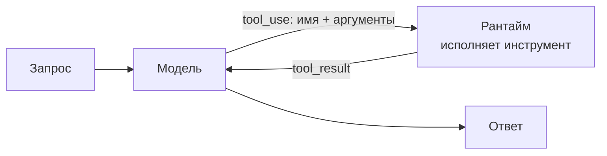

# Function / tool calling

> Модель возвращает структурированный вызов инструмента, рантайм его исполняет и возвращает результат в контекст - базовый механизм действия, на котором стоят почти все агентные паттерны.

## Суть

**Function / tool calling** - не «паттерн рассуждения», а **примитив действия**. Разработчик описывает инструменты (имя, описание, JSON-схему аргументов); модель, когда сочтет нужным, вместо текста возвращает структурированный **вызов** (`tool_use`: имя + аргументы); рантайм исполняет функцию и отдает результат обратно (`tool_result`); модель продолжает с учетом результата.

Это фундамент, поверх которого строятся [ReAct](../../01-reasoning/react/) (цикл вокруг вызовов), agentic RAG, CodeAct и мультиагентные топологии. Один «оборот» function calling - это ровно один шаг ReAct-цикла; сам паттерн ReAct - это лишь дисциплина «крутить такие обороты, пока не будет ответа».

Anthropic особо подчеркивает **agent-computer interface (ACI)**: описания инструментов, форматы аргументов, примеры и poka-yoke-параметры нужно проектировать так же тщательно, как UX для людей. Плохой ACI ломает агента так же, как плохой UI ломает человека - это часто важнее выбора самого паттерна.

Современные надстройки механизма: **параллельные вызовы** (несколько `tool_use` в одном ответе - исполнять concurrently и вернуть все результаты одним сообщением), **строгие схемы** (`strict` - гарантия валидности аргументов), **tool_choice** (авто / принудительный / запрет), **tool search** (динамическая подгрузка описаний из большой библиотеки инструментов).

## Схема

Схема в отдельном файле: [`diagram.mmd`](diagram.mmd).

## Когда применять / когда не применять

**Применять, если:**
- модели нужны внешние данные или действия (API, БД, файлы, вычисления);
- нужен структурированный, машинно-исполнимый вывод вместо свободного текста;
- это база для любого агента с инструментами.

**Не применять, если:**
- задача чисто текстовая и инструменты не нужны (тогда обычный промпт / CoT);
- достаточно одного детерминированного вызова API без участия модели в выборе.

## Компромиссы

- **Надежность за счет структуры.** Структурированный вызов проще исполнять и валидировать, чем парсить текст. `strict`-схемы дополнительно гарантируют форму аргументов.
- **Качество ↔ ACI.** Результат сильно зависит от описаний инструментов: расплывчатое описание → неверные или лишние вызовы.
- **Стоимость.** Каждый оборот - отдельный вызов LLM; на длинных цепочках это основной драйвер затрат (см. [ReWOO](../../01-reasoning/rewoo/) как ответ на это).
- **Поверхность атаки.** Инструменты с побочными эффектами расширяют injection-риск; чувствительные действия - за HITL/песочницу (группа 07).

## Вариации и развитие

- **[ReAct](../../01-reasoning/react/)** - цикл рассуждение→вызов→наблюдение поверх этого механизма.
- **[Agentic RAG](../agentic-rag/)** - извлечение знаний как инструмент под управлением модели.
- **CodeAct** - действие выражается исполняемым кодом вместо JSON-вызова.
- **Toolformer / Gorilla** - как научить модель *когда* и *какие* инструменты звать (self-supervised / массовое подключение API).

## Реализации

- **Без фреймворков:** [`example.py`](example.py) - определение одного инструмента, один оборот `tool_use → tool_result → ответ` на голом Anthropic Messages API. Это тот самый примитив, вокруг которого ReAct строит цикл.
- **SDK/фреймворки:** нативный tool calling есть во всех крупных SDK; циклом управляют tool runner'ы (Anthropic), LangGraph, OpenAI Agents SDK.

## Источники

- Anthropic, «Building effective agents» и документация по tool use - про ACI и дизайн инструментов.
- Механизм не привязан к одной статье; продуктово оформился в 2023 (OpenAI function calling, Anthropic tool use).
- Сводка по группе: [`../README.md`](../README.md).

## Мои заметки

- Вкладываться в ACI: описания-примеры-poka-yoke часто дают больший прирост, чем смена паттерна.
- Проверить, где нужны параллельные вызовы (независимые инструменты) - это заметно снижает латентность.
