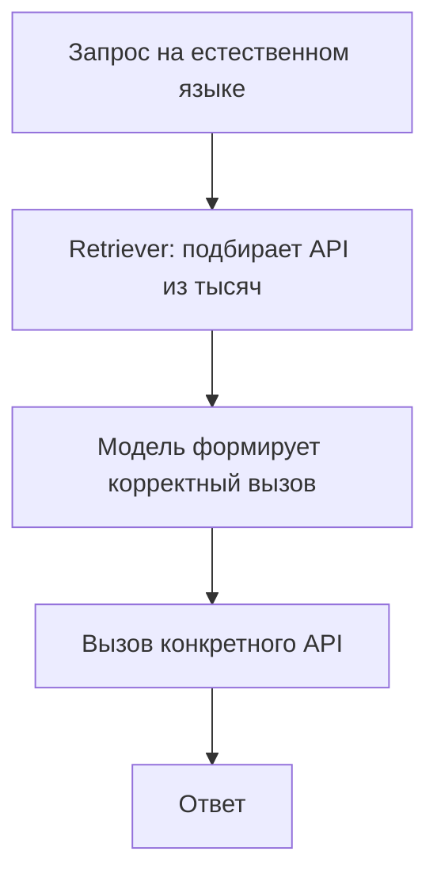

# Gorilla

> LLM, соединенный с массой реальных API: retrieval подбирает нужный интерфейс из тысяч, а модель формирует корректный вызов - и все это меряется Berkeley Function-Calling Leaderboard.

## Суть

**Gorilla** (Patil et al., NeurIPS 2024) решает проблему масштаба: инструментов не единицы, а **тысячи**, и все их описания в контекст не влезают, а модель склонна «галлюцинировать» несуществующие API. Подход:
- **Retriever-aware обучение** - модель учат работать в связке с ретривером, который по запросу достает релевантные описания API из большой базы (документация подставляется в контекст);
- за счет этого модель формирует **синтаксически и семантически корректные** вызовы к реальным, актуальным API и реже выдумывает несуществующие.

Побочный, но важный результат проекта - **Berkeley Function-Calling Leaderboard (BFCL)**: стандартный бенчмарк качества function calling (одиночные/параллельные/множественные вызовы, релевантность, галлюцинации), ставший индустриальной точкой отсчета. Так Gorilla - это и метод (масштабирование tool use через retrieval), и мерило (как сравнивать модели по вызову функций).

## Схема

Схема в отдельном файле: [`diagram.mmd`](diagram.mmd).

## Когда применять / когда не применять

**Применять, если:**
- инструментов слишком много, чтобы держать все описания в контексте (сотни-тысячи API);
- важно снизить долю галлюцинированных/неверных вызовов на большом каталоге;
- нужно измерять качество function calling - берите BFCL.

**Не применять, если:**
- инструментов немного - их описания просто кладутся в контекст без ретривера;
- набор API стабилен и мал (retrieval добавит сложность без выгоды).

## Компромиссы

- **Масштаб vs сложность.** Retrieval-подход открывает тысячи API, но добавляет компонент (ретривер + база описаний) и зависимость от качества поиска.
- **Актуальность API.** Подстановка документации на лету позволяет работать с меняющимися API без переобучения модели.
- **Оценка.** BFCL дает честное сравнение, но, как любой бенчмарк, не заменяет проверку на своих реальных инструментах.

## Вариации и развитие

- **[Function calling](../function-calling/)** - базовый механизм; **tool search** (динамическая подгрузка описаний) - это ровно retrieval-идея Gorilla в продуктовой обертке.
- **[Toolformer](../toolformer/)** - соседний подход: не retrieval, а вшивание инструментального поведения в веса self-supervised обучением.

## Реализации

- **Без кода в карточке:** ядро Gorilla - retriever + обученная модель + каталог API; это инфраструктура, а не «суть в 40 строк». Практический аналог «retrieval поверх большого набора инструментов» - tool search в современных SDK.

## Источники

- Patil et al. «Gorilla: Large Language Model Connected with Massive APIs», NeurIPS 2024 - arXiv:2305.15334.
- Berkeley Function-Calling Leaderboard (BFCL).
- Сводка по группе: [`../README.md`](../README.md).

## Мои заметки

- Если инструментов много - начать с tool search (retrieval описаний), прежде чем городить свой каталог.
- Мерить качество вызовов на своих API, а не только по BFCL.
