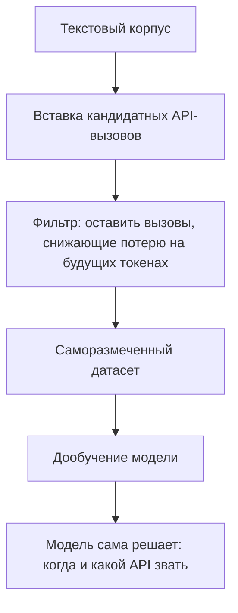

# Toolformer

> Модель сама учится, когда и какие API вызывать, размечая для себя обучающие данные self-supervised способом - это метод обучения, а не рантайм-механизм.

## Суть

**Toolformer** (Schick et al., NeurIPS 2023) отвечает не на вопрос «как исполнить вызов» (это [function calling](../function-calling/)), а на вопрос «как научить модель самой решать, *когда* и *какой* инструмент звать». Ключ - **self-supervised разметка**:
1. В обычный текстовый корпус модель вставляет **кандидатные** вызовы API в местах, где они могли бы помочь;
2. Каждый кандидат исполняется, и вызов **оставляют только если** его результат снижает потерю (perplexity) на последующих токенах - то есть реально помогает предсказать продолжение;
3. На получившемся саморазмеченном датасете модель **дообучают**.

В итоге способность к инструментам «зашивается» в веса: модель по контексту сама решает вызвать калькулятор, поиск, календарь и т.п. Это ранняя и влиятельная работа, показавшая, что использованию инструментов можно научить без ручной разметки. Сегодня современные модели во многом обучены вызывать инструменты «из коробки», но идея self-supervised полезности вызова осталась концептуально важной.

## Схема

Схема в отдельном файле: [`diagram.mmd`](diagram.mmd).

## Когда применять / когда не применять

**Применять, если:**
- нужно **научить** модель инструментальному поведению под свой набор API (не просто исполнять вызовы);
- есть корпус и ресурсы на дообучение, а полезность вызова измерима через loss.

**Не применять, если:**
- достаточно текущей модели с нативным [function calling](../function-calling/) - большинству задач дообучение не нужно;
- нет данных/ресурсов на self-supervised разметку и файнтюн.

## Компромиссы

- **Интернализация vs гибкость.** Способность зашита в веса (не нужно каждый раз объяснять в промпте), но набор инструментов фиксируется на этапе обучения - новый API требует переобучения.
- **Стоимость обучения.** Разметка (исполнение кандидатов) и файнтюн - дорого по сравнению с промпт-механизмом.
- **Актуальность.** Во многом поглощена современными моделями, обученными на tool use; ценна как концепция «оставляй вызов, только если он снижает потерю».

## Вариации и развитие

- **[Function calling](../function-calling/)** - рантайм-механизм, которым пользуется обученная так модель.
- **[Gorilla](../gorilla/)** - соседний подход: подключение к массе API и оценка через Berkeley Function-Calling Leaderboard.

## Реализации

- **Без кода в карточке:** Toolformer - процедура обучения (разметка + файнтюн), а не рантайм-петля; минимального «сырого» примера-запуска у нее нет. Референс - статья и ее реализации.

## Источники

- Schick et al. «Toolformer: Language Models Can Teach Themselves to Use Tools», NeurIPS 2023 - arXiv:2302.04761.
- Сводка по группе: [`../README.md`](../README.md).

## Мои заметки

- Проверить, действительно ли нужен файнтюн: часто нативного tool calling достаточно.
