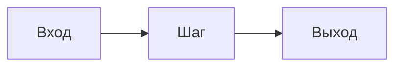

---
# ── Метаданные карточки (YAML front matter) ──
# Из этих полей build_index.py собирает сводную таблицу в README. Не удалять поля.
id: react                    # kebab-case, ДОЛЖЕН совпадать с именем папки паттерна; по нему ссылаются related
name: ReAct                  # человекочитаемое имя
group: reasoning             # slug группы: reasoning | tool-use | memory-context | workflows | multi-agent | self-improvement | infra-safety-eval
status: established          # established | emerging | experimental
year: 2022                   # год первой публикации/появления
paper: arXiv:2210.03629      # основной источник; если нет - поставить "-"
related: [rewoo, plan-and-execute, reflexion]  # id других карточек (см. поле id)
tags: [single-agent, tool-use, loop]           # свободные теги, kebab-case
---

# {{ name }}

> Одно предложение: что это и зачем. Заполнить перед публикацией.

## Суть

Что это за паттерн и какую проблему он решает. 2-4 абзаца.

## Схема

## Когда применять / когда не применять

**Применять, если:**
- …

**Не применять, если:**
- …

## Компромиссы

Стоимость (число LLM-вызовов / токенов), латентность, надежность. По возможности - конкретные цифры со ссылкой на источник и пометкой «заявлено автором» vs «подтверждено независимо».

## Вариации и развитие

Родственные и производные паттерны, как паттерн менялся, куда движется. Связи через `related` в front matter.

## Реализации

Фреймворки и ссылки на код. Минимальный пример без фреймворков - в `example.py` рядом с этой карточкой. Реализации на LangGraph и т.п. - отдельно, они устаревают быстрее.

## Источники

- Автор(ы), название, площадка, год, arXiv/DOI/URL.

## Мои заметки

Личные наблюдения, вопросы, идеи для экспериментов.
